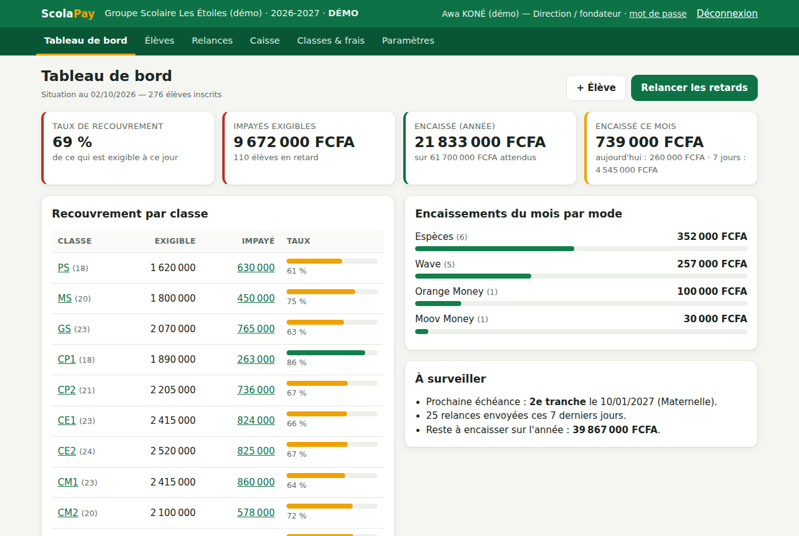
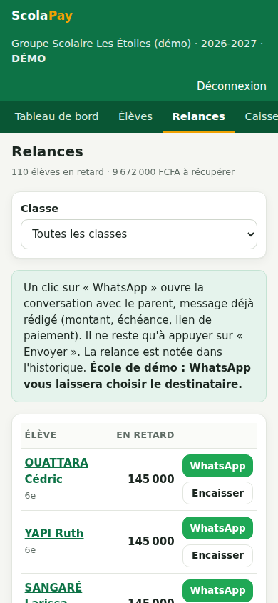
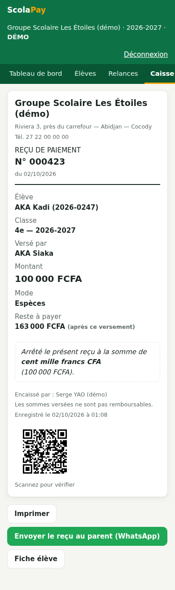
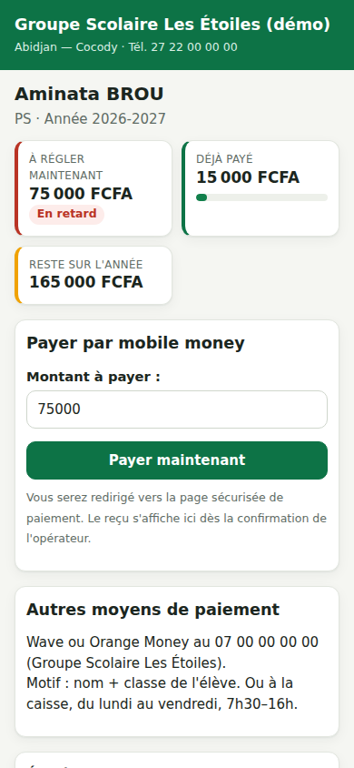

# ForCash → **ScolaPay**

### Le business : aider les écoles privées d'Afrique francophone à encaisser leurs scolarités, et l'application pour le faire.

> **ScolaPay** est un nom de travail.
> Ce dépôt contient le business complet : l'analyse, le business plan, le plan d'action, le kit de vente, le modèle financier **et l'application, prête à être montrée aux écoles**.

---

## Le business en 1 minute

**Le problème.** Une école privée vit de ses frais de scolarité. Pourtant, elle les gère souvent avec un cahier, Excel et une caisse en espèces. Conséquences : des impayés qui mettent en danger la paie des enseignants, des heures passées à relancer les parents, des reçus perdus et de l'argent qui « disparaît » à la caisse.

**La solution.** Une application web, utilisable sur n'importe quel téléphone, qui :
- calcule en temps réel **qui doit combien**, classe par classe ;
- envoie les **relances WhatsApp en un clic**, avec un message déjà rédigé et un lien de paiement ;
- produit des **reçus numérotés avec QR code**, impossibles à falsifier ou à supprimer ;
- permet aux parents de **payer par mobile money** (Wave, Orange Money, MTN, Moov) ;
- donne au fondateur un **tableau de bord** et un **journal de caisse** pour tout contrôler à distance.

**Qui paie.** L'école : **500 ou 1 000 FCFA par élève et par an**, soit moins de 1 % de ses frais de scolarité. Pour une école de 400 élèves, récupérer seulement 5 % d'impayés en plus rapporte **3 millions de FCFA**, pour un coût de 400 000 FCFA. L'école y gagne 7 fois sa mise.

**Le marché.** En Côte d'Ivoire, 76,6 % des établissements du secondaire général sont privés et accueillent 64 % des élèves ([source](https://www.agenceecofin.com/actualites-services/2205-138688-education-en-cote-d-ivoire-le-secteur-prive-face-au-controle-de-l-etat)). La même solution se vend ensuite au Sénégal, au Cameroun, au Bénin, au Togo, au Burkina Faso…

**Les objectifs** (scénario de base, détaillé et modifiable dans le [modèle financier](docs/modele-financier.xlsx)) :

| | An 1 | An 2 | An 3 |
|---|---:|---:|---:|
| Écoles clientes | 40 | 180 | 500 |
| Chiffre d'affaires | 7,7 M FCFA | 38,7 M FCFA | 127 M FCFA |
| Résultat | +2,6 M | +8,4 M | +41 M |
| Revenu annuel récurrent | 12 M | 58 M | **175 M FCFA** |

**Mise de départ : environ 1 million de FCFA.** Le produit existe déjà : l'argent sert à aller voir les écoles, pas à développer.

---

## Pourquoi ce business, et pas un autre ?

J'ai comparé les idées qu'on conseille le plus souvent en Afrique de l'Ouest :

| Idée | Capital de départ | Premier revenu | Potentiel | Le problème |
|---|---|---|---|---|
| Élevage de poulets | 2 à 5 M FCFA | 2 mois | Moyen | Maladies, prix de l'aliment, marge qui fond |
| E-commerce en paiement à la livraison | 0,5 à 2 M | 2 à 4 semaines | Moyen, instable | Publicité chère, colis refusés, concurrence |
| Motos en location-vente | 3 à 10 M | 1 mois | Moyen à élevé | Vols, accidents, interdictions municipales |
| Appartements meublés | 3 à 10 M | 1 à 2 mois | Moyen | Vacance locative, dégradations |
| Eau en sachet | 5 à 15 M | 2 à 3 mois | Moyen | Autorisations, concurrence, logistique |
| **ScolaPay (logiciel + paiements pour écoles)** | **≈ 1 M** | **1 à 3 mois** | **Très élevé** | **Une vente lente au début : il faut gagner la confiance** |

**Ce qui rend riche, c'est un revenu qui revient chaque année, avec une marge élevée, que l'on peut multiplier sans multiplier les coûts.** Un poulet vendu doit être ré-élevé. Une école abonnée paie à nouveau l'an prochain, et servir 500 écoles ne coûte presque pas plus cher que d'en servir 50. À terme, une entreprise de ce type, rentable et présente dans plusieurs pays, peut valoir **plusieurs milliards de FCFA** (voir le [business plan §11](docs/01-business-plan.md#11-prévisions-financières-scénario-de-base-en-fcfa)).

> **Honnêtement :** aucun business ne garantit la richesse. Celui-ci a peu de risque financier (environ 1 M FCFA) et un fort potentiel, mais **tout repose sur ta capacité à aller voir des fondateurs d'écoles, à les convaincre et à bien les servir.** Si tu n'aimes pas du tout la vente, associe-toi dès le départ à quelqu'un qui l'aime.

---

## Ce que contient ce dépôt

| Document | Contenu |
|---|---|
| 📘 [Business plan](docs/01-business-plan.md) | Problème, marché chiffré, concurrence, modèle économique, économie unitaire, juridique, risques. Partageable avec un banquier, un associé ou un concours. |
| 🗓️ [Plan d'action 90 jours](docs/02-plan-90-jours.md) | Semaine par semaine, à partir du 5 octobre 2026 : objectifs, budget, règles d'arrêt. |
| 🎯 [Kit commercial](docs/03-kit-commercial.md) | Questions de découverte, pitch de 2 minutes, démo de 10 minutes, réponses aux objections, convention de pilote, messages WhatsApp. |
| 📊 [Modèle financier](docs/04-modele-financier.md) et [tableur Excel](docs/modele-financier.xlsx) | Projection sur 3 ans, trésorerie mois par mois, économie unitaire, calcul du ROI pour l'école. Toutes les hypothèses sont modifiables. |
| 🛠️ [Guide technique](docs/05-guide-technique.md) | Installer, mettre en ligne, sauvegarder, brancher le paiement mobile money. |
| 🏫 [Guide de l'école](docs/06-guide-ecole.md) | Mise en place d'une école en 48 heures et mode d'emploi pour la direction et la caisse. |
| 📇 [Fichier de suivi des prospects](docs/suivi-prospects.csv) | À ouvrir dans Excel ou Google Sheets. |

### L'application (déjà fonctionnelle)

| Relances WhatsApp | Reçu anti-fraude | Espace parent |
|---|---|---|
|  |  |  |

- **Plusieurs écoles** sur une même installation, avec un cloisonnement strict des données.
- **Rôles** : direction ou fondateur, caisse ou secrétariat.
- **Barèmes et échéanciers**, remises, élèves qui quittent l'école, années scolaires, réinscriptions.
- **Paiements** : espèces, Wave, Orange Money, MTN, Moov, virement, chèque. Reçus numérotés, montant en lettres, QR code de vérification. Annulation tracée, jamais de suppression.
- **Relances WhatsApp** pré-rédigées, avec historique.
- **Espace parent** : solde, échéancier, reçus et paiement en ligne (démo intégrée, CinetPay prévu).
- **Import Excel/CSV**, exports, journal de caisse imprimable.
- **12 pays** pris en charge : formats de téléphone et monnaies (FCFA, GNF, FC, Ariary).
- **Une école de démonstration réaliste** (276 élèves) pour les rendez-vous commerciaux.
- **52 tests automatiques.**

---

## Essayer l'application

> **Important :** `127.0.0.1` veut dire « cet appareil-ci ». Ce lien ne fonctionne que sur l'ordinateur où l'application est lancée, et seulement tant que sa fenêtre reste ouverte. Il ne fonctionnera jamais depuis un téléphone ou un autre ordinateur.

Choisis l'une des trois méthodes. Dans tous les cas, connecte-toi avec **`directeur.demo`** (vue de la direction) ou **`caisse.demo`** (vue de la caisse).

### Option 1 : sur ton ordinateur Windows, Mac ou Linux

1. Installe [Python](https://www.python.org/downloads/) (version 3.10 ou plus récente). Sous Windows, coche **« Add python.exe to PATH »** au début de l'installation.
2. Sur cette page GitHub, clique sur le bouton vert **Code**, puis **Download ZIP**, et décompresse le fichier.
3. Dans le dossier décompressé :
   - **Windows** : double-clique sur **`demarrer.bat`**. Si Windows affiche un avertissement, clique sur « Informations complémentaires », puis « Exécuter quand même ».
   - **Mac ou Linux** : ouvre un terminal dans le dossier et tape `sh demarrer.sh`.
4. Le navigateur s'ouvre tout seul sur <http://127.0.0.1:8000>. Le mot de passe est **`Demo-ScolaPay-2026`**.

La première fois, l'installation prend 1 à 2 minutes. **Laisse la fenêtre du lanceur ouverte** : la fermer arrête l'application.

### Option 2 : sans rien installer, depuis le navigateur d'un ordinateur

1. Clique sur le bouton, puis sur **Create codespace**. Il faut un compte GitHub ; GitHub offre un quota gratuit chaque mois.
2. Après 2 à 3 minutes, l'application s'installe, démarre et s'ouvre dans un nouvel onglet. Si l'onglet ne s'ouvre pas, va dans l'onglet **Ports** en bas de l'écran et clique sur l'icône 🌐 de la ligne « ScolaPay ».
3. Le mot de passe est **`Demo-ScolaPay-2026`**.

Arrête le codespace quand tu as fini (menu Codespaces, puis Stop) pour ne pas consommer ton quota.

### Option 3 : une démo en ligne, ouvrable depuis un téléphone

1. Crée un compte gratuit sur Render (tu peux te connecter avec GitHub), puis clique sur le bouton.
2. Choisis un mot de passe dans le champ `SCOLAPAY_DEMO_PASSWORD` et valide.
3. Environ 5 minutes plus tard, ta démo est en ligne à une adresse du type `https://scolapay-demo.onrender.com`. Elle s'ouvre depuis n'importe quel téléphone : pratique pour tes rendez-vous avec les écoles.

L'offre gratuite se met en veille après 15 minutes sans visite : le chargement suivant prend alors environ une minute. Les données sont aussi remises à zéro à chaque redémarrage. Pour de vraies écoles, suis le [guide technique](docs/05-guide-technique.md#2-mettre-en-ligne).

### Ça ne marche pas ?

| Ce que tu vois | Que faire |
|---|---|
| « Ce site est inaccessible » ou `ERR_CONNECTION_REFUSED` sur 127.0.0.1 | L'application ne tourne pas sur cet appareil. Lance `demarrer.bat` ou `demarrer.sh` (option 1) et garde la fenêtre ouverte. Sur un téléphone, utilise l'option 3. |
| « Python 3.10 ou plus récent est introuvable » | Installe Python en cochant « Add python.exe to PATH », puis relance. |
| « Identifiant ou mot de passe incorrect » | Options 1 et 2 : `Demo-ScolaPay-2026`. Option 3 : le mot de passe choisi sur Render. |
| Une autre erreur dans la fenêtre du lanceur | Copie le message et envoie-le à Claude. |

L'installation manuelle, pour les développeurs, est décrite dans le [guide technique](docs/05-guide-technique.md#1-lancer-lapplication-sur-ton-ordinateur-10-minutes).

---

## Tes 7 premiers jours

1. **Jour 1** : lis le [business plan](docs/01-business-plan.md) et le [plan 90 jours](docs/02-plan-90-jours.md). Lance la démo.
2. **Jour 2** : entraîne-toi à faire la démo complète en 10 minutes ([kit commercial §4](docs/03-kit-commercial.md#4-la-démo-de-10-minutes)).
3. **Jour 3** : dresse la liste de 150 écoles privées dans 2 ou 3 communes proches de chez toi.
4. **Jours 4 à 7** : réalise tes **12 premiers entretiens** (3 par jour), sans chercher à vendre : écoute et note les chiffres.
5. À la fin de la semaine, relis tes notes : combien d'écoles ont un vrai problème d'impayés ? Combien veulent essayer ?

**Prochaine étape après 30 entretiens : 5 écoles pilotes.** Tout est dans le [plan 90 jours](docs/02-plan-90-jours.md).
